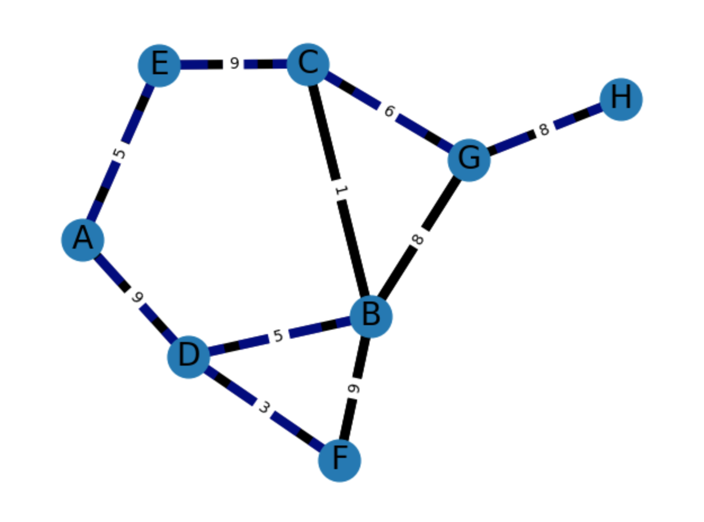
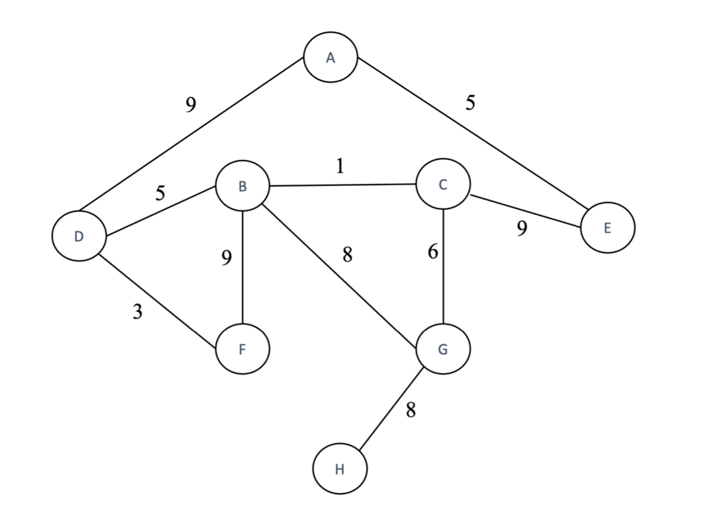

## Graph Algorithms 

Algorithms implemented in Java, then ouputted as json via a (very bad) custom json serializer.

json file is read by a python script to generate a graph visualization using networkx and matplotlib.

I used the graph from the assignment to verify my implementation shown here as genereated by my code.

